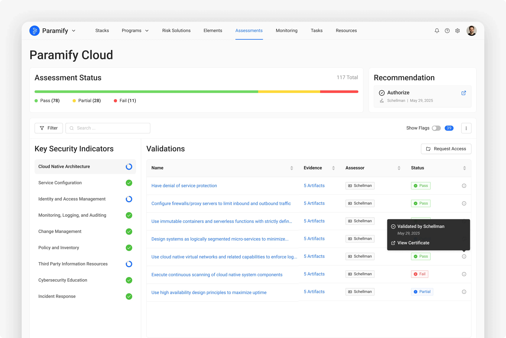
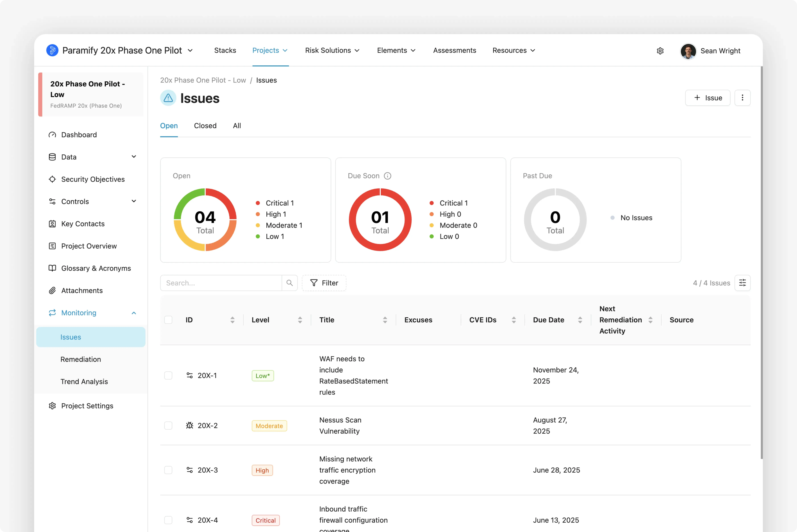

# Paramify's FedRAMP 20x Phase One Pilot Draft Submission

## Paramify Overview

<p align="center">
   <a href="https://paramify.com">
     
   </a>
</p>

The **Paramify Cloud** (Paramify) is a software platform that automates risk management processes – including compliance planning, solution implementation, gap assessments, and continuous reporting – for cloud service providers, government agencies, and members of the Defense Industrial Base (DIB). Trusted by leading CSPs like Adobe, Cisco, Trellix, Palo Alto Networks, and Flock Safety.

- **Living Gap Assessment**
Visualize compliance progress with Paramify’s intuitive real-time dashboard. Track controls, manage gaps, and easily organize people, places, and components, ensuring audit readiness for FedRAMP 20X, GovRAMP, and other frameworks.

- **Instant Audit-Ready Documentation**
Automate compliance, generate audit-ready deliverables like System Security Plans (SSPs), POA&Ms, and Customer Responsibility Matrices in days, not months. Continuously validate compliance with real-time automated validation tools for FedRAMP 20X and other frameworks.

- **Fast, Cost-Effective Monitoring**
Continuously monitor, validate, and report compliance 90% faster at a quarter of the cost. Paramify’s automated tools and Evidence Repository simplify compliance, reducing costs and enhancing efficiency. Integrated with issue management tools like Jira, it streamlines workflows, helping you meet tight deadlines.

---

## ☁️ CSP Approach

Our approach can be summarized with the following steps:

1. **Lightweight Documentation**  
   Document the implementation of KSIs using Paramify Cloud with the FedRAMP 20x validations set.

2. **Key Security Indicators and Validations**  
   Gather and upload evidence into Paramify Cloud for each KSI validation, using automation where possible.

3. **Validate Evidence**  
    Meet with 3PAO and have them review and validate evidence in Paramify Cloud.

4. **Automate Machine-readable Package**  
   Publish our machine readable format package using Paramify Cloud.

5. **3PAO Review**  
   3PAO reviews the package and adds attestation.

6. **Continuous Reporting Indication**  
   Either on demand or per an automated schedule, a new package will be generated with the most current evidence.

7. **Prototype for Continuous Reporting**  
   It is anticipated that Paramify Cloud will allow for a shareable link that shows the KSI dashboard.

8. **CSP Rationale and Summary**  
   Summary of and rationale for the approach used to generate the machine-readable file, and evidence generation methods.

9. **CSP Submission**  
   Similar to the Continuous Reporting capability, the package will be available either with a viewable link or through the machine-readable package file with a friendly HTML viewer.
   
---

## Step-by-Step Details

### Step 1 – Lightweight Documentation
Document the implementation of our KSIs using Paramify Cloud with the FedRAMP 20x validations set.


### Step 2 – Key Security Indicators and Validations
Gather and upload evidence into Paramify Cloud for each KSI validation, using automation where possible. Instructions and commands for each evidence object are included to provide context to the evidence process and results.


### Step 3 – Validate Evidence
Meet with 3PAO and have them review and validate evidence in Paramify Cloud. 3PAO can set Assurance Steps, Assurance Status, remarks, etc. 


### Step 4 – Automate Machine Readable Package
Publish our machine readable format package using Paramify Cloud’s DocRobot capabilities.
Our draft package submission is represented using YAML due to its simplicity.  Though YAML is our current proposal, Paramify can support OSCAL, JSON, or other common formats.

---

## 📑 Assessment File Structure
The machine-readable assessment file is a YAML file with the following structure (see [machine-readable-package/schema.yaml](machine-readable-package/schema.yaml)):

```yaml
Package:
  CSPName: <Company name of Cloud Service Provider>
  CSO: <Cloud Service Offering / Name of application>
  impact: <Low | Moderate | High>
  summaryOfCSO: <Description of CSO>
  Assessments:
  - Assessment:
    digitalSignature: <SHA hash of assessment elements below>
    assessorOrg: <Third Party Assessment Organization>
    date: <date of assessment>
    leadAssessor: <name of lead assessor>
    recommendation: <Authorize | Do Not Authorize>
    remarks: <assessment remarks>
    KSIs:
    - KSI:
      name: <name of KSI>
      shortName: <shortname of KSI>
      status: <status of implementation - Complete | Incomplete>
      Validations:
      - validation:
        id: <validation id>
        shortName: <shortname of validation>
        description: <description of validation>
        implementation: <short description of approach>
        implementationStatus: <True | False | Partial>
        digitalSignature: <SHA hash of validation elements>
        assessmentStatus: <True | False | Partial >
        assessedBy: <name of assessor>
        assessedOn: <date validation was assessed>
        remarks: <remarks from assessor>
        Evidences:
        - evidence:
          id: <evidence id>
          name: <name of evidence>
          description: <description of evidence>
          instructions: <how to retrieve evidence>
          automated: <True | False>
          commands: <computer instruction used if automated>
          scriptName: <filename>
          validationRules:
          - rule:
            id: <rule id>
            textValue: <value to look for in output file>
          validatedBy: <name of assessor>
          validateDate: <date evidence was validated>
          remarks: <remarks from assessor>
          Artifacts:
          - artifact:
            name: <name of artifact>
            reference: <evidence file>
            outputResults: <output of script if automated>
            effectiveDate: <date of evidence>
```

---

**Below is a sample YAML file:**
```yaml
Package:
 CSPName: Paramify
 CSO: Paramify Cloud
 impact: Low
 summaryOfCSO: The Paramify Cloud (Paramify) is a software platform that automates risk management processes—including compliance planning, solution implementation, gap assessments, and documentation—for cloud service providers, government agencies, and members of the Defense Industrial Base (DIB). It supports compliance with NIST 800-53 (FedRAMP, FISMA, GovRAMP), NIST 800-171 (CMMC), SOC 2, HIPAA, ISO 27001, and more.
 Assessments:
   - Assessment:
       digitalSignature: 7b23c3e01fca304e1f34d5fe1aa57c594de3e810
       assessorOrg: Schellman
       date: 5/28/2025
       leadAssessor: Pete Waterman
       recommendation: Authorize
       remarks: All evidence satisfied the KSIs. This assessment was performed by reviewing the evidence artifacts and validations provided.
       KSIs:
         - KSI:
             name: Cloud Native Architecture
             shortName: KSI-CNA
             status: Complete
             Validations:
               - validation:
                   id: 1
                   shortName: KSI-CNA-1
                   description: Have denial of service (DoS) protection
                   implementation: AWS WAF
                   implementationStatus: True
                   digitalSignature: 6b7bf289ee3f5e33750b507576c94183b59ae246
                   assessmentStatus: True
                   assessedBy: Pete Waterman
                   assessedOn: 5/25/2025
                   remarks: Having reviewed the WAF rules script and evidence artifacts...
                   Evidences:
                     - evidence: 
                         id: 1.1
                         name: WAFrulesconfig
                         description: WAF rules config
                         instructions: List all web ACLs to identify the ones with DoS protection
                         automated: True
                         commands: aws wafv2 list-web-acls; aws wafv2 get-web-acl
                         scriptName: waf_DoS_rules.sh
                         validationRules: 
                           - rule:
                               id: 1.1
                               textValue: RateBasedStatement
                         validatedBy: Pete Waterman
                         validateDate: 5/25/2025
                         remarks: The script result includes a rule with priority 1, rate based limit of 2000...
                         Artifacts:
                           - artifact:
                               name: WAF DoS Rules Result
                               reference: waf_dos_rules.json
                               outputResults: {
                                                "results": [
                                                  {
                                                    "WebACLId": "fb14t971-0bfc-4f57-970c-16gjd7ae0566",
                                                    "WebACLName": "WAFv2-web-acl",
                                                    "Rules": [
                                                      {
                                                        "Name": "rate-limit-rule",
                                                        "Priority": 1,
                                                        "Statement": {
                                                          "RateBasedStatement": {
                                                            "Limit": 2000,
                                                            "AggregateKeyType": "IP"
                                                          }
                                                        },
                                                        "Action": {
                                                          "Block": {}
                                                        ...
                                              }
                               effectiveDate: 5/23/25
```

### Step 5 - 3PAO Review
3PAO reviews package and adds attestation. This is included at the Assessment level in the machine-readable package
```
  - Assessment:
    digitalSignature: <SHA hash of assessment elements below>
    assessorOrg: <Third Party Assessment Organization>
    date: <date of assessment>
    leadAssessor: <name of lead assessor>
    recommendation: <Authorize | Do Not Authorize>
    remarks: <assessment remarks>
```

### Step 6 - Continuous Reporting Indication
Either on demand or per an automated schedule, a new package will be generated with the most current evidence using Paramify's DocRobot capability.

### Step 7 - Prototype for Continuous Reporting
It is anticipated that Paramify Cloud will allow for a shareable link that shows the KSI dashboard. The view will look similar to the following images.





### Step 8 - CSP Rationale and Summary
Summary of and rationale for the approach used to generate the machine-readable file, and evidence generation methods is provided with the machine-readable package file.

### Step 9 - CSP Submission
Similar to the Continuous Reporting capability, the package will be available either with a viewable link in Paramify or through the machine-readable package file with a friendly HTML viewer.

An example of the HTML viewer (free and open-source, operates offline based on YAML machine-readable package file) can be accessed below or in the [html-dashboard directory](https://github.com/paramify/fedramp-20x-pilot/tree/main/html-dashboard)

<p align="center">
   <a href="https://iteuscher.github.io/fedramp20x/Dashboard/20x-yaml-dashboard-lorem.html">
     
   </a>
</p>
<p align="center">
   <a href="https://iteuscher.github.io/fedramp20x/Dashboard/20x-yaml-dashboard-lorem.html">
    
  </a>
</p>

---

## 📩 Contact
Reach out to federal@paramify.com for questions, demos, or 3PAO access.
