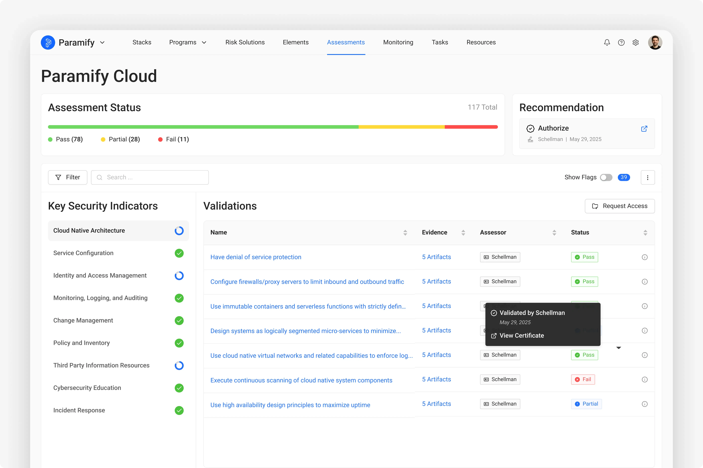
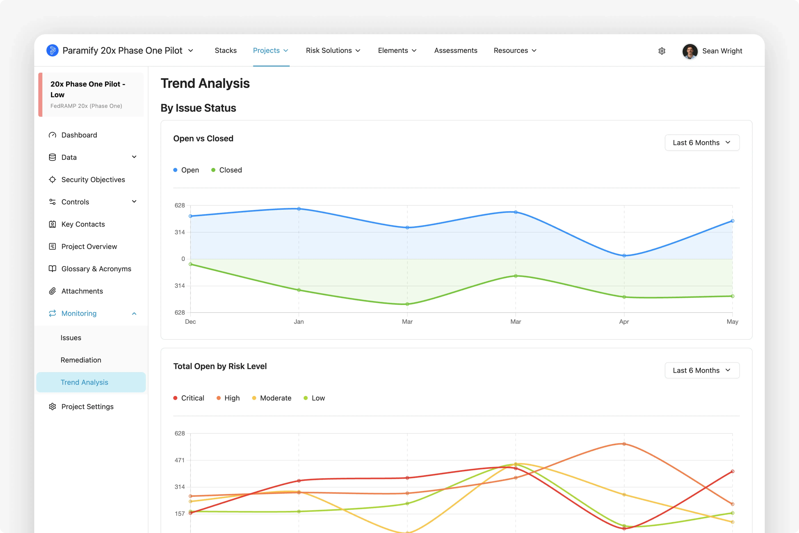
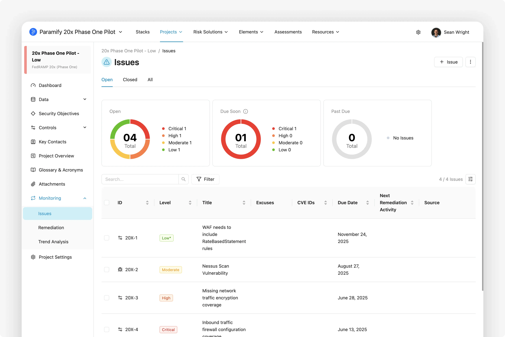
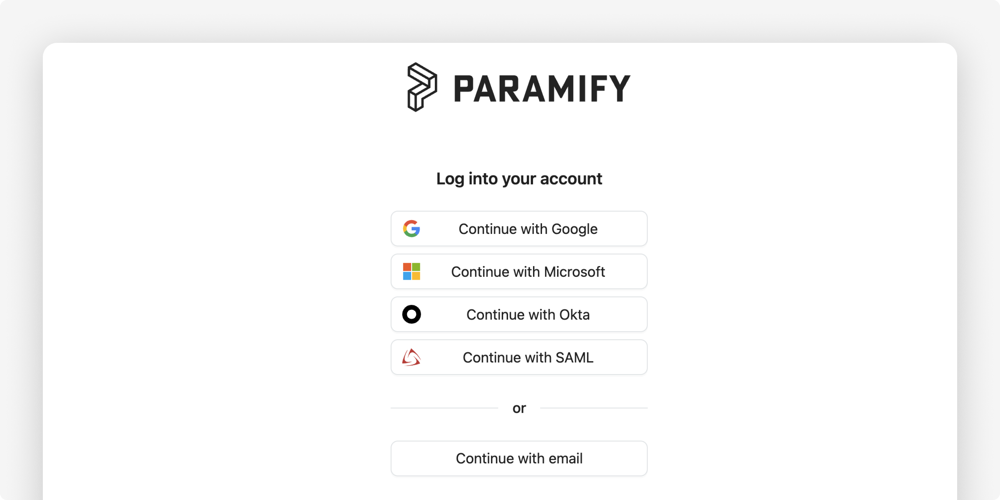
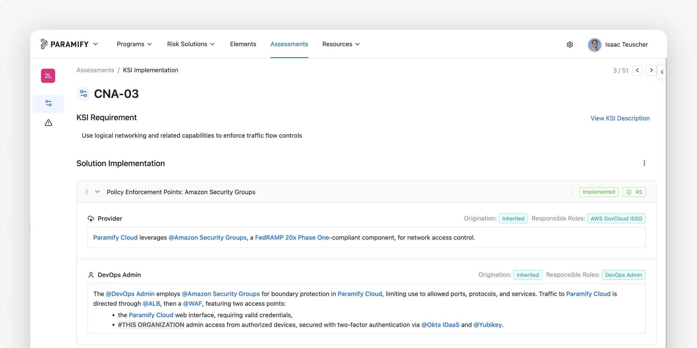
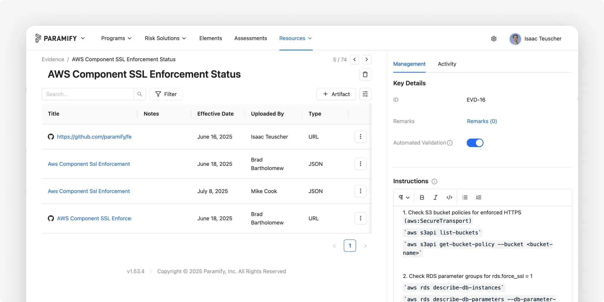
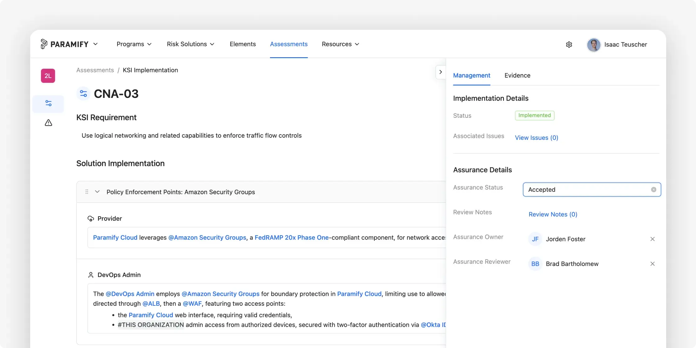
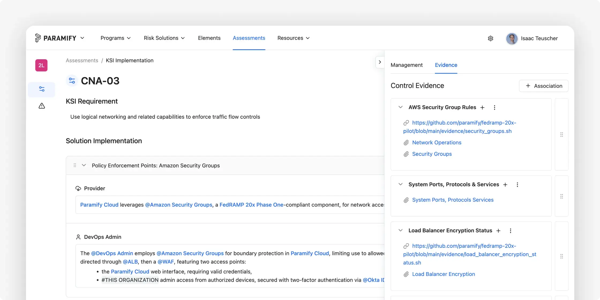

<p align="center">
   <a href="https://paramify.com">
     
   </a>
</p>

# Paramify's FedRAMP 20x Phase One Pilot Final Submission

## Table of Contents
- [Paramify Overview](#paramify-overview)
- [Points of Contact](#points-of-contact)
- [Authorization Package Materials](#authorization-package-materials)
- [Trust Portal Access](#trust-portal-access)
- [Services Included in Authorization](#services-included-in-authorization)
- [Continuous Monitoring](#continuous-monitoring)
- [Compliance Deliverables (POA&Ms, Significant Change Notifications, Incident Reports, etc)](#compliance-deliverables-poams-significant-change-notifications-incident-reports-etc)
- [Agency Secure Configuration Guidance](#agency-secure-configuration-guidance)
- [AI Use](#ai-use)
- [Future Plans](#future-plans)
- [CSP Approach](#csp-approach)
- [Step-by-Step Implementation Details](#step-by-step-implementation-details)
- [Assessment File Structure](#assessment-file-structure)
- [Contact](#contact)
---

## Paramify Overview

The **Paramify Cloud** (Paramify) is a software platform that automates risk management processes — including compliance planning, solution implementation, gap assessments, and continuous reporting — for cloud service providers, government agencies, and members of the Defense Industrial Base (DIB). Trusted by leading CSPs like Adobe, Cisco, Trellix, Palo Alto Networks, and Flock Safety.

- **Living Gap Assessment**
Visualize compliance progress with Paramify's intuitive real-time dashboard. Track controls, manage gaps, and easily organize people, places, and components, ensuring audit readiness for FedRAMP 20X, GovRAMP, and other frameworks.

- **Instant Audit-Ready Documentation**
Automate compliance, generate audit-ready deliverables like System Security Plans (SSPs), POA&Ms, and Customer Responsibility Matrices in days, not months. Continuously validate compliance with real-time automated validation tools for FedRAMP 20X and other frameworks.

- **Fast, Cost-Effective Monitoring**
Continuously monitor, validate, and report compliance 90% faster at a quarter of the cost. Paramify's automated tools and Evidence Repository simplify compliance, reducing costs and enhancing efficiency. Integrated with issue management tools like Jira, it streamlines workflows, helping you meet tight deadlines.

---

## Points of Contact

### CSP - Paramify
- **Kenny Scott, CEO** - kenny@paramify.com
- **Brad Bartholomew, CISO** - brad@paramify.com
- **Isaac Teuscher, Sr. Security Engineer** - isaac.teuscher@paramify.com

### 3PAO - Coalfire
- **Jorden Foster, Sr. Director** - jorden.foster@coalfire.com

---

## Authorization Package Materials

The following authorization package materials are available in this repository:

- **Latest Machine-readable assessment file**: [machine-readable-package/8_29_25_paramify_coalfire_20x_machine_readable.yaml](machine-readable-package/8_29_25_paramify_coalfire_20x_machine_readable.yaml) (Submitted Aug 29, 2025)
- **Previous Machine-readable assessment file**: [machine-readable-package/7_10_25_paramify_coalfire_20x_machine_readable.yaml](machine-readable-package/7_10_25_paramify_coalfire_20x_machine_readable.yaml) (Submitted July 10, 2025)
- **Assessment file schema**: [machine-readable-package/schema.yaml](machine-readable-package/schema.yaml)
- **Evidence collection scripts**: [/evidence](./evidence) directory
- **3PAO Assessment Report**: [Coalfire Paramify Fed RAMP 20x Validated Assessment.pdf](./Coalfire%20Paramify%20Fed%20RAMP%2020x%20Validated%20Assessment%207%2010%2025.pdf)

---

## Trust Portal Access

Evidence for each KSI and POA&Ms can be accessed in the [Paramify application](https://app.paramify.com). FedRAMP PMO and agencies can request access to the trust portal by emailing **federal@paramify.com**.

---

## Services Included in Authorization

**Paramify Cloud** - The Paramify SaaS platform as described in the [Paramify Overview](#paramify-overview) section above.

*No specific license requirements beyond standard Paramify Cloud subscription.*

---

## Continuous Monitoring

Paramify provides comprehensive continuous monitoring capabilities including:

- **Real-time Compliance Dashboard** - Live view of KSI validation status
- **Trend Analysis Dashboard** - Historical compliance trends and metrics
- **Issues Dashboard** - Active POA&Ms and remediation tracking

Example dashboards:




These live dashboards are available in the Paramify application to those who have been granted access. Automated reporting can be generated on-demand or at scheduled intervals using Paramify's DocRobot capability.

---

## Compliance Deliverables (POA&Ms, Significant Change Notifications, Incident Reports, etc)

The following compliance documentation and artifacts are available in the Paramify application to those who have been granted access:

- **Plan of Action & Milestones (POA&Ms)**
- **Significant Change Notifications** 
- **Incident Reports**
- **Continuous monitoring reports and supporting artifacts**
- **Authorization Boundary**
- **Traditional Rev 5 SSP**

---

## Agency Secure Configuration Guidance

Instructions to help agencies securely configure an instance of Paramify Cloud for federal use:

### Federated Identity
- **Login Options**: [Login Options Overview](https://support.paramify.com/hc/en-us/articles/34460081656211-Login-Options-Overview)
- Support for SSO via Google, Microsoft, Okta, and SAML
- Email-based "magic link" authentication method available
- Session timeout configurable by workspace administrators



### Role/Attribute Based Access Control
- **User Types**: Admin, Editor, and Collaborator roles with granular permissions
- **Teams**: Group users and assign roles at the team level
- **Collaborator Access Controls**: Customizable access restrictions including "Full Access to Owned" for sensitive data
- Principle of least privilege implementation with role-based restrictions. Learn more [here](https://support.paramify.com/hc/en-us/articles/33817002784147-Users-and-Teams).

### API Integration
- **Comprehensive API Coverage**: Access to Evidence, Issues, Deviations, Milestones, and Assessment Cycles
- **Paramify MCP Server**: Beta version available for enhanced AI integration capabilities
- Granular permissions for API keys with configurable expiration times
- Secure API authentication and authorization
- **API Key Management**: [Create a Paramify API Key](https://support.paramify.com/hc/en-us/articles/43292803890451-Create-a-Paramify-API-Key)
- **API Documentation**: [Access Paramify API Documentation](https://support.paramify.com/hc/en-us/articles/43294099176211-Access-Paramify-API-Documentation)

### Auditing & Logging
- Comprehensive audit logging of all user actions
- Retention policies compliant with federal requirements
- All activities completed in Paramify by users are tracked and displayed for transparency and accountability.

---

## AI Use

Paramify is introducing new opt-in AI features built with Llama, an open source AI model secured entirely within the Paramify Cloud to prevent third party access. Paramify's AI capabilities include intelligent risk solution generation, element suggestions, and automated remediation plan summaries to enhance compliance workflows and decision-making processes.

Paramify does not use any of your data to train the model nor do we retain your data for future processing, and your data is not communicated to any external third party services. Data is not processed by the AI model without the user explicitly executing the AI-specific features.


---

## Future Plans

See the complete [Paramify Roadmap](https://www.figma.com/proto/r4VEEjigV9TVEe1MBYBdsD/Paramify-Roadmap?page-id=0%3A1&n%5B=&node-id=352-7959&starting-point-node-id=352%3A7959) for detailed upcoming features.

### Planned Enhancements

- **Continuous Validation and Reporting** - Enhanced continuous monitoring features with real-time validation status updates will be part of the Paramify interface in upcoming release. See examples of Paramify's continuous monitoring capabilities in the above section: [Continuous Monitoring](#continuous-monitoring)

- **API-Available Authorization Materials** - Complete authorization package materials are accessible via API endpoints. See [Paramify API documentation](https://app.paramify.com/api/documentation/#/), MCP server integration available.

- **Automated Significant Change Notifications** - Automated change notification and approval processes in upcoming Paramify release. 

- **Collaborative Continuous Monitoring Meetings** - Paramify application dashboards provide current issues and monitoring metrics. In addition, a monthly collaborative meeting will be scheduled with interested agencies to provide monthly ConMon status and discussion.  

- **Enhanced Ongoing Authorization Requirements** - Automated compliance monitoring and reporting for ongoing authorization will continue to expand with upcoming Paramify application releases. 

---

## CSP Approach

Our approach can be summarized with the following steps:

1. **Lightweight Documentation**  
   Document the implementation of KSIs using Paramify Cloud with the FedRAMP 20x validations set.

2. **Key Security Indicators and Validations**  
   Gather and upload evidence into Paramify Cloud for each KSI validation, using automation where possible.

3. **Validate Evidence**  
    Meet with 3PAO and have them review and validate evidence in Paramify Cloud.

4. **Automate Machine-readable Package**  
   Generate and publish our machine-readable package using Paramify Cloud.

5. **3PAO Review**  
   3PAO reviews the package and adds attestation.

6. **Continuous Reporting Indication**  
   Either on-demand or per an automated schedule, a new package will be generated with the most current evidence.

7. **Prototype for Continuous Reporting**  
   It is anticipated that Paramify Cloud will allow for a shareable link that shows the KSI dashboard.

8. **CSP Rationale and Summary**  
   Summary of and rationale for the approach used to generate the machine-readable file, and evidence generation methods.

9. **CSP Submission**  
   Similar to the Continuous Reporting capability, the package will be available either with a viewable link or through the machine-readable package file with a friendly HTML viewer.

---

## Step-by-Step Implementation Details

### Step 1 — Lightweight Documentation
Document the implementation of our KSIs using Paramify Cloud with the FedRAMP 20x validations set.


### Step 2 — Key Security Indicators and Validations
Gather and upload evidence into Paramify Cloud for each KSI validation, using automation where possible. Instructions and commands for each evidence object are included to provide context to the evidence process and results.


Paramify primarily uses bash scripts to call IaaS/SaaS APIs and collect evidence for each FedRAMP 20x KSI. A selection of evidence scripts is included in the [`/evidence`](./evidence) directory.

### Step 3 — Validate Evidence
Meet with 3PAO and have them review and validate evidence in Paramify Cloud. 3PAO can set Assurance Steps/Results, Assurance Status, and leave notes or remarks. 



Paramify is working with Coalfire as 3PAO for this FedRAMP 20x Assessment. The assessment report from Coalfire is available here: 
[**Coalfire Paramify Fed RAMP 20x Validated Assessment.pdf**](./Coalfire%20Paramify%20Fed%20RAMP%2020x%20Validated%20Assessment%207%2010%2025.pdf)

### Step 4 — Automate Machine Readable Package
Publish our machine-readable format package using Paramify Cloud's DocRobot capabilities.
Our draft package submission is represented using YAML due to its simplicity. Though YAML is our current proposal, Paramify can support OSCAL, JSON, or other common formats.

### Step 5 - 3PAO Review
3PAO reviews package and adds attestation. This is included at the Assessment level in the machine-readable package

### Step 6 - Continuous Reporting Indication
Either on-demand or per an automated schedule, a new package will be generated with the most current evidence using Paramify's DocRobot capability.

### Step 7 - Prototype for Continuous Reporting
It is anticipated that Paramify Cloud will allow for a shareable link that shows the KSI dashboard. The view will look similar to the following images.


### Step 8 - CSP Rationale and Summary
A summary of and rationale for the approach used to generate the machine-readable file, and evidence generation methods is provided with the machine-readable package file.

### Step 9 - CSP Submission
Similar to the Continuous Reporting capability, the package is available by a viewable link in Paramify or through the machine-readable package file with a friendly HTML viewer.

---

## Assessment File Structure
The machine-readable assessment file is a YAML file with the following structure (see [machine-readable-package/schema.yaml](machine-readable-package/schema.yaml)):

```yaml
Package:
  CSPName: <Company name of Cloud Service Provider>
  CSO: <Cloud Service Offering / Name of application>
  impact: <Low | Moderate | High>
  summaryOfCSO: <Description of CSO>
  Assessments:
  - Assessment:
    digitalSignature: <SHA hash of assessment elements below>
    assessorOrg: <Third Party Assessment Organization>
    date: <date of assessment>
    leadAssessor: <name of lead assessor>
    recommendation: <Authorize | Do Not Authorize>
    remarks: <assessment remarks>
    KSIs:
    - KSI:
      name: <name of KSI>
      shortName: <shortname of KSI>
      Validations:
      - validation:
        shortName: <shortname of validation>
        description: <description of validation>
        implementation: <short description of approach>
        implementationStatus: <True | False | Partial>
        digitalSignature: <SHA hash of validation elements>
        assessmentStatus: <True | False | Partial >
        assessedBy: <name of assessor>
        assessedOn: <date validation was assessed>
        remarks: <remarks from assessor>
        Evidences:
        - evidence:
          id: <evidence id>
          name: <name of evidence>
          description: <description of evidence>
          instructions: <how to retrieve evidence>
          commands: <computer instruction used if automated>
          automated: <True | False>
          scriptName: <filename>
          validationRules:
          - rule:
            id: <rule id>
            textValue: <value to look for in output file>
          validatedBy: <name of assessor>
          validateDate: <date evidence was validated>
          remarks: <remarks from assessor>
          Artifacts:
          - artifact:
            name: <name of artifact>
            reference: <evidence file>
            outputResults: <output of script if automated>
            effectiveDate: <date of evidence>
```

**Below is a sample YAML file:**
```yaml
Package:
 CSPName: Paramify
 CSO: Paramify Cloud
 impact: Low
 summaryOfCSO: The Paramify Cloud (Paramify) is a software platform that automates risk management processes—including compliance planning, solution implementation, gap assessments, and documentation—for cloud service providers, government agencies, and members of the Defense Industrial Base (DIB). It supports compliance with NIST 800-53 (FedRAMP, FISMA, GovRAMP), NIST 800-171 (CMMC), SOC 2, HIPAA, ISO 27001, and more.
 Assessments:
   - Assessment:
       digitalSignature: 7b23c3e01fca304e1f34d5fe1aa57c594de3e810
       assessorOrg: Coalfire
       date: 7/14/2025
       leadAssessor: Pete Waterman
       recommendation: Authorize
       remarks: All evidence satisfied the KSIs. This assessment was performed by reviewing the evidence artifacts and validations provided.
       KSIs:
         - KSI:
             name: Cloud Native Architecture
             shortName: KSI-CNA
             Validations:
               - validation:
                   id: 1
                   shortName: KSI-CNA-01
                   description: Have denial of service (DoS) protection
                   implementation: AWS WAF
                   implementationStatus: True
                   digitalSignature: 6b7bf289ee3f5e33750b507576c94183b59ae246
                   assessmentStatus: True
                   assessedBy: Pete Waterman
                   assessedOn: 6/30/2025
                   remarks: Having reviewed the WAF rules script and evidence artifacts...
                   Evidences:
                     - evidence: 
                         id: 1.1
                         name: WAFrulesconfig
                         description: WAF rules config
                         instructions: List all web ACLs to identify the ones with DoS protection
                         automated: True
                         commands: aws wafv2 list-web-acls; aws wafv2 get-web-acl
                         scriptName: waf_DoS_rules.sh
                         validationRules: 
                           - rule:
                               id: 1.1
                               textValue: RateBasedStatement
                         validatedBy: Pete Waterman
                         validateDate: 6/29/2025
                         remarks: The script result includes a rule with priority 1, rate based limit of 2000...
                         Artifacts:
                           - artifact:
                               name: WAF DoS Rules Result
                               reference: waf_dos_rules.json
                               outputResults: |
                                 {
                                    "results": [
                                      {
                                        "WebACLId": "fb14t971-0bfc-4f57-970c-16gjd7ae0566",
                                        "WebACLName": "WAFv2-web-acl",
                                        "Rules": [
                                          {
                                            "Name": "rate-limit-rule",
                                            "Priority": 1,
                                            "Statement": {
                                              "RateBasedStatement": {
                                                "Limit": 2000,
                                                "AggregateKeyType": "IP"
                                              }
                                            },
                                            "Action": {
                                              "Block": {}
                                            ...
                                  }
                               effectiveDate: 5/23/25
```

<p align="center">
   <a href="https://iteuscher.github.io/fedramp20x/Dashboard/20x-yaml-dashboard-lorem.html">
    
  </a>
</p>

---

## Contact

Reach out to **federal@paramify.com** for questions, demos, or 3PAO access.